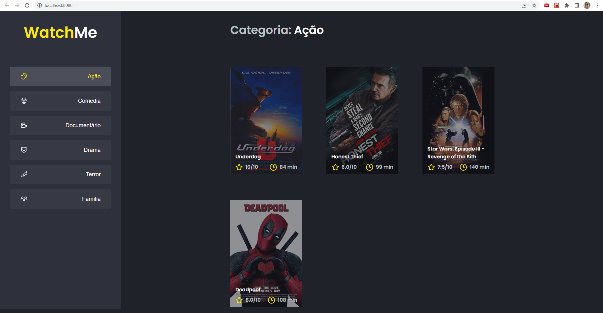
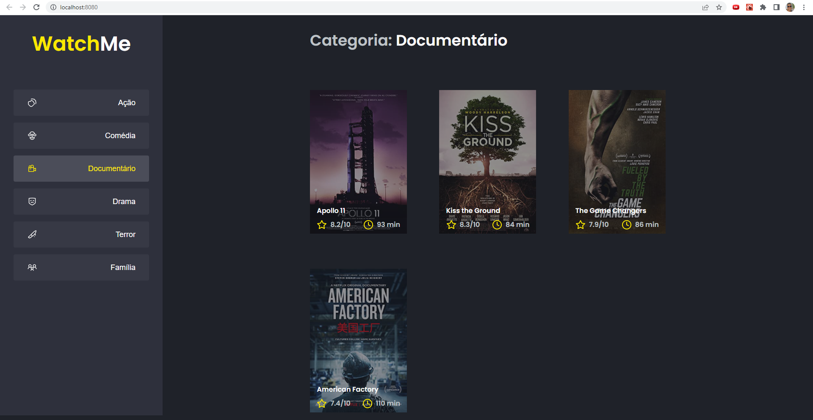

<h1 align="center"> 
  WatchMe
</h1>

---

Table of Contents
=================
<!--ts-->
  * [Screenshots](#-screenshots)
  * [About the project](#-about-project)
  * [Technologies](#-technologies)
  * [How to use](#-how-to-use)
<!--te-->

---

## Screenshots <a name="-screenshots" style="text-decoration:none"></a>


          


---

## About the project <a name="-about-project" style="text-decoration:none"></a>

This project I did in the Rocketseat course. I created a movie platform. It takes the information from the json and uses that information to show the available movies on the screen. Each movie has a genre that can be seen in the sidebar.

It was important for me because I learned to use axios to send requests to the server.

---

## Technologies <a name="-technologies" style="text-decoration:none"></a>
  
- **[React](https://en.reactjs.org/)**
- **[Axios](https://github.com/axios/axios)**
- **[Typescript](https://www.typescriptlang.org/)**
- **[Sass](https://sass-lang.com/)**

--- 

## How to use <a name="-how-to-use" style="text-decoration:none"></a>

```bash

# Clone this repository
$ git clone https://github.com/samircunha/WatchMe.git

# Go to the folder
$ cd WATCHME

# Install the dependencies
$ yarn install

# Run the server
$ yarn server

# Run the application 
$ yarn dev

#The project will run on port <http://localhost:8080/>
```
